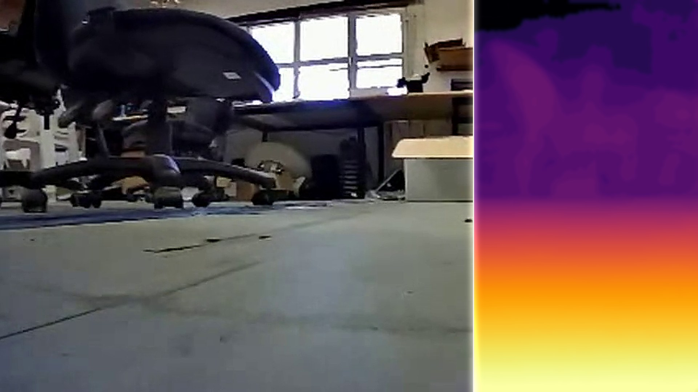

<div align="center">

# Seeing to Drive on a Single Board

**Attention-free distilled depth on a Raspberry Pi 5 + Hailo-8L, and the onboard obstacle avoidance, planning and SLAM it enables**

Itai M. · 2026

[Project page](https://itaim18.github.io/seeing-to-drive/) · [Paper](docs/paper.pdf) · [Thesis](docs/thesis.pdf) ·
[Dataset](https://huggingface.co/datasets/itaimizlish/daniel-yard-depth) · [Model](https://huggingface.co/itaimizlish/daniel-student-depth)

<a href="https://itaim18.github.io/seeing-to-drive/"></a>

</div>

This repository holds the project page (`docs/`). The weights (PyTorch, ONNX, Hailo-8L HEF) and the 11.5 GB dataset are
on Hugging Face; the code is available on request.

```bibtex
@misc{itaim2026seeing,
  title  = {Seeing to Drive on a Single Board: Attention-Free Distilled Depth on a Raspberry Pi 5 + Hailo-8L
            for Onboard Obstacle Avoidance, Planning and SLAM},
  author = {M., Itai},
  year   = {2026},
  url    = {https://itaim18.github.io/seeing-to-drive/}
}
```
